This repository is part of the supplementary materials for the ICIP 2024 submission titled "VR-based generation of photorealistic synthetic data for training hand-object tracking models". It provides several helpful scripts for rendering high-quality synthetic sequences of Hand-Object Interactions performed in VR using Blender. It also provides scripts for export data in the [DexYCB format](https://dex-ycb.github.io/).

The original Blender files are currently only provided to ICIP reviewers for the peer-review process. These materials will be released conditioned on the acceptance of the paper for publication. 

Please appropriately reference the following paper in any publication making use of the Software.
Citation: [...]


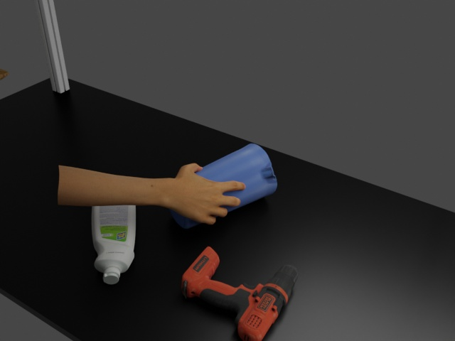 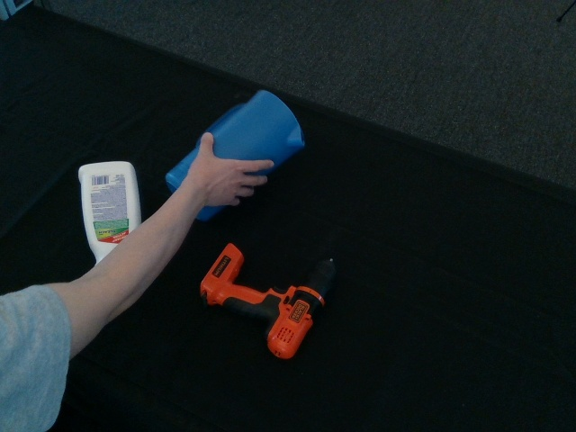

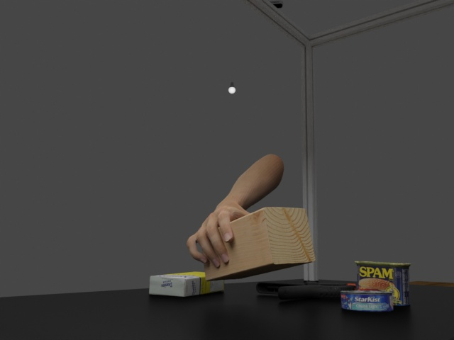 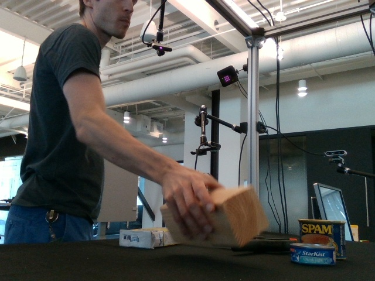

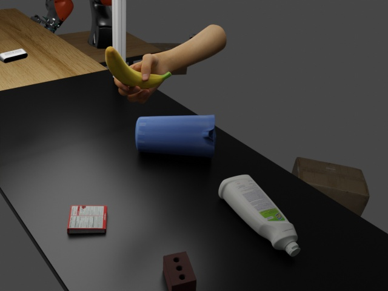 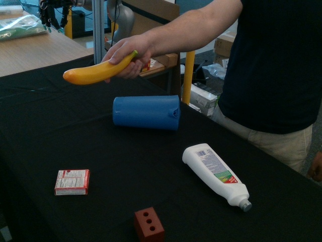

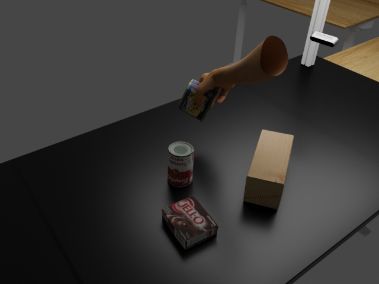 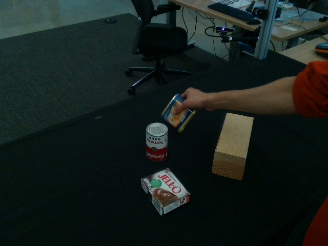
<figure>
<figcaption>Qualitative comparison of sample blender-hoisynth images (left) with real DexYCB images (right). </figcaption>
</figure>

<br><br>


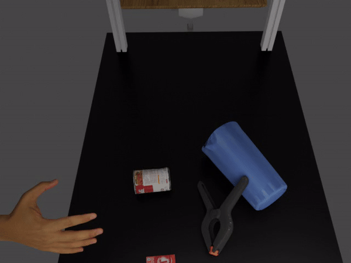
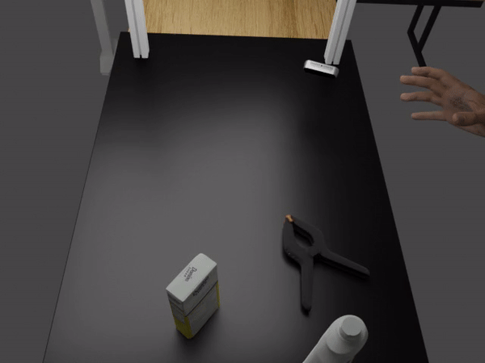
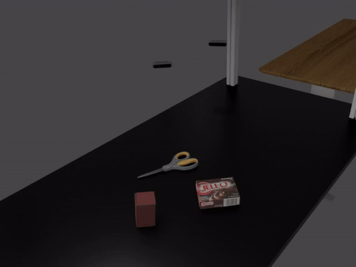
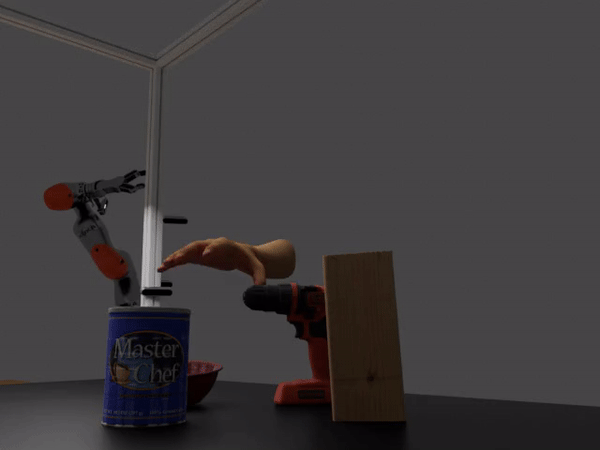
<figure>
<figcaption>Sample HOI videos generated using blender-hoisynth. </figcaption>
</figure>


# Requirements
Python<=3.10

# Installation
Clone this repository and install requirements
```bash
git clone git@github.com:wetoo-cando/blender-hoisynth.git
cd blender-hoisynth
pip install -r requirements.txt
```

Install [UPBGE 0.30](https://github.com/UPBGE/upbge/releases)

Replace VR config file
```bash
mv scripts/defaults.py /path/to/UPBGE/blender/scripts/addons/viewport/vr_preview/configs/defaults.py
```

Clone [blenderproc](https://github.com/DLR-RM/BlenderProc) with SHA 31ebb06c2ea2581da25f1f3e4f9544c4b0cad8a4 to the repository

```bash
cd blender-hoisynth
git clone git@github.com:DLR-RM/BlenderProc.git
cd BlenderProc
git reset 31ebb06c2ea2581da25f1f3e4f9544c4b0cad8a4
```

Add rendering property files to BlenderProc
```bash
cd ..
mv scripts/write_dexycb_data2.py BlenderProc/blenderproc/python/writer/write_dexycb_data2.py
mv scripts/BopWriterUtility.py BlenderProc/blenderproc/python/loader/BlendLoader.py
mv scripts/BlendLoader.py BlenderProc/blenderproc/python/loader/BlendLoader.py
```

Add code
```bash
from blenderproc.python.writer.write_dexycb_data2 import write_dexycb_data2
``` 
to the end of BlenderProc/blenderproc/api/writer/__init__.py

Move the rendering folder to BlenderProc
```bash
mv rendering BlenderProc/examples
```
Add transforms3d to install_requires in BlenderProc/setup.py
Add "transforms3d==0.4.1" to the end of BlenderProc/blenderproc/python/utility/DefaultConfig.py

Install blenderproc
```bash
cd BlenderProc
pip install -e .
python setup.py install
blenderproc pip install coloredlogs
```

Clone [manopth](https://github.com/hassony2/manopth) to BlenderProc/examples/rendering

Move the scripts/generate_hand_pose.py to manopth
```bash
mv scripts/generate_hand_pose.py  BlenderProc/examples/rendering/manopth
```
# Use
Download the [blendfiles]() for the demo and the blender-hoisynth software. For the ICIP2024 reviewers, we have provided access details to the blendfiles in the supplementary materials. These materials will be released publicly conditioned on the acceptance of the paper for publication.

### Recording
Recording should be done on Windows.

Objects initial poses can be extracted from DexYCB by running
```bash 
python examples/rendering/generaate_initial_poses.py --DexYCB_dir /path/to/DexYCB --output_dir /path/to/output/dir
```

Open blender-hoisynth-v28 with UPBGE, record with VR headset.

Press P to enter play mode, R to record, Space to save recorded animation and D to drop recorded animation.

### Rendering
A demo is provided in blendfiles to run the rendering.

Download the assets folder to blender-hoisynth for background objects generation

Run
```bash
cd BlenderProc
blenderproc run examples/rendering/render_animation.py --blend_dir /path/to/blend/files --assets_dir /path/to/assets/folder --pose_dir /path/to/object/initial/position/folder --output_folder /path/to/output/folder --Subject_id your subject id --hand_armature hand armature name
```

### Mano parameters generation
Download the calibration folder from [DexYCB](https://dex-ycb.github.io/) and place it in blender-hoisynth/assets/calibration

Then run
```bash
python examples/rendering/manopth/generate_hand_pose.py --callibration_dir /path/to/calibration/folder -pose_dir /path/to/object/initial/position/folder --output_dir /path/to/render/results --mano_dir /mano/shape/parameter/folder/name --Subject_id your subject id
```